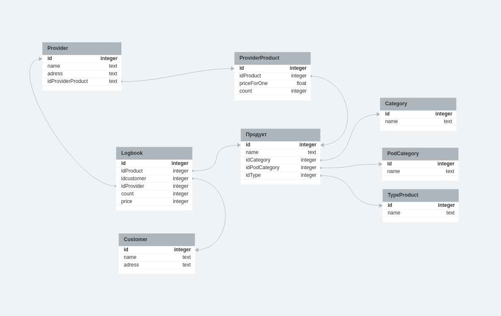
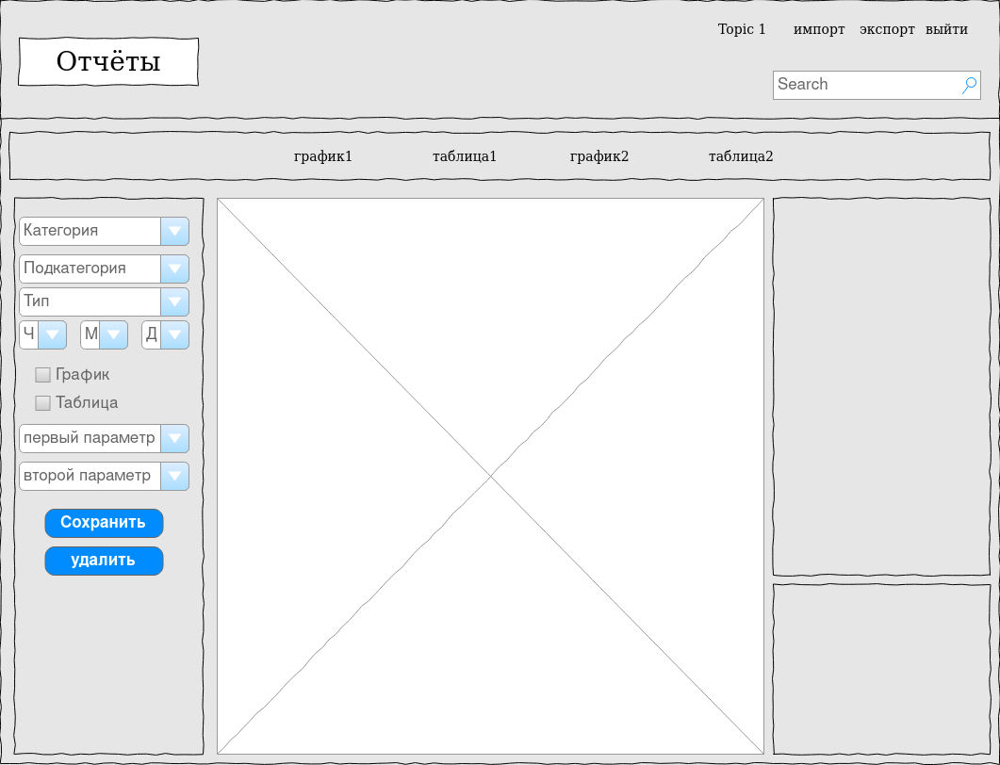
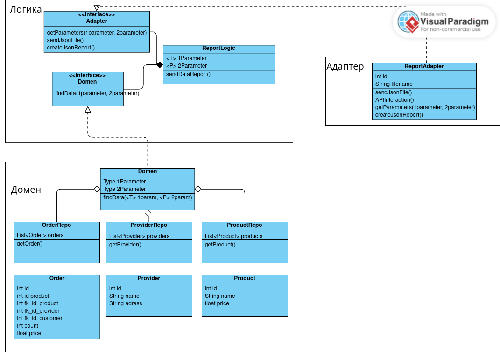

### Адаптер формирует отчет в json, реализуя контракт логики на основе полученных данных
### логика на основе полученных параметров, делает запрос в базу данных, получает и отдает сырые данные в адаптер
### в домене идет поиск по БД, идет выборка данных по таблицам 